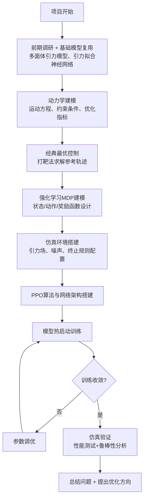

# 小行星附着最优轨迹设计：基于强化学习的建模与分析

## 1. 引言

我本科期间主持了《小行星附着最优轨迹设计与仿真分析》大创项目，所以以此为题。

我在大创中使用了多面体模型获得高精度引力场数据，设计了神经网络，以航天器与小行星相对位置为输入，输出引力加速度矢量与引力梯度。其次，建立航天器动力学模型，以最小能量和燃料消耗为核心目标，通过切比雪夫伪谱法将连续最优控制问题转化为非线性规划（NLP）问题，采用序列二次规划（SQP）算法求解。最后，通过蒙特卡洛仿真验证鲁棒性。但是项目中使用了深度神经网络并没有利用强化学习进行最优轨迹的求解。

传统上，求解最优轨迹的过程过程被视为一个**确定性轨迹优化问题**，通过庞特里亚金极大值原理（PMP）求解。本文将小行星附着最优控制问题离散化表述为马尔可夫决策过程，使用使用打靶法对简化的小行星模型进行最优轨迹的求解得到**参考轨迹**，然后利用强化学习（RL）基于参考轨迹在**真实**的小行星引力场上进行求解。

**项目整体技术流程**

## 2. 问题抽象与动力学建模

### 2.1 非惯性系下的非线性动力学

小行星附着问题的核心难点在于其动力学环境。大部分小行星都有快速的自转且存在不规则引力场，而航天器的推力有限难以满足高精着陆要求。

在体坐标系 $\mathcal{F}_B$ 下，探测器的运动方程不仅受到微弱且不规则引力的驱动，还受到旋转参考系引入的非惯性力耦合。我们探测器的运动方程可表示为：

$$
\begin{cases} \dot{\mathbf{r}} = \mathbf{v} \\ \dot{\mathbf{v}} = -2\boldsymbol{\omega} \times \mathbf{v} - \boldsymbol{\omega} \times (\boldsymbol{\omega} \times \mathbf{r}) + \nabla U(\mathbf{r}) + \frac{T_{\text{max}} u}{m} \boldsymbol{\alpha} \\ \dot{m} = -\frac{T_{\text{max}} u}{I_{sp} g_0} \end{cases} \tag{1}
$$

从控制理论角度看，这是一个典型的**欠驱动、强耦合、非线性系统**。

* 前两项为非惯性系引入的虚拟力：$-2\boldsymbol{\omega} \times \mathbf{v}$ 是科氏力；$-\boldsymbol{\omega} \times (\boldsymbol{\omega} \times \mathbf{r})$ 是离心力。
* 第三项 $\nabla U(\mathbf{r})$ 是引力加速度，是整个动力学模型中最具非线性特征的部分。
* 第四项是推力加速度，体现了有限推力的幅值约束（$u \leq 1$）与方向自由度。
* 质量变化方程是燃料最优控制的核心，直接关联后续的优化目标与强化学习奖励函数。

#### 2.1.1 非惯性力的三维分量形式

将矢量叉乘展开为体固系下的分量形式，便于数值计算与强化学习状态输入设计：

$$
-2\boldsymbol{\omega} \times \mathbf{v} = \begin{bmatrix} 2\omega \dot{y} \\ -2\omega \dot{x} \\ 0 \end{bmatrix}, \quad -\boldsymbol{\omega} \times (\boldsymbol{\omega} \times \mathbf{r}) = \begin{bmatrix} \omega^2 x \\ \omega^2 y \\ 0 \end{bmatrix} \tag{2}
$$

非惯性力在 $x-y$ 平面产生耦合作用，$z$ 轴方向不受自转非惯性力的直接影响。这一特性可用于简化强化学习的状态空间设计，或作为物理约束显式加入网络控制。

#### 2.1.2 高精度引力场建模：多面体模型+神经网络拟合

小行星引力场的不规则性是传统解析方法失效的根本原因。球谐函数展开仅适用于近似球形的天体，在靠近不规则小行星表面时会因高阶项发散；而**多面体引力模型**通过将小行星表面离散为三角面片，可精确计算任意位置的引力势和引力加速度：

$$
U(\mathbf{r}) = G \rho \sum_{e \in \text{edges}} \mathbf{r}_e \cdot \mathbf{E}_e \cdot \mathbf{r}_e \ln L_e - G \rho \sum_{f \in \text{faces}} \mathbf{r}_f \cdot \mathbf{F}_f \cdot \mathbf{r}_f \omega_f \tag{3}
$$

其中 $G$ 为万有引力常数，$\rho$ 为小行星密度，$\mathbf{E}_e$ 和 $\mathbf{F}_f$ 为边和面的几何张量，$L_e$ 和 $\omega_f$ 为边长和立体角。
多面体模型虽然精度极高，但计算复杂度与三角面片数 $N$ 成正比（$O(N)$），计算效率极低。我在在大创中设计了一个引力场拟合神经网络：

* **输入**：探测器相对位置 $\mathbf{r}$（3维）。
* **输出**：引力加速度 $\nabla U(\mathbf{r})$（3维）和引力梯度张量 $\nabla^2 U(\mathbf{r})$（9维）。
* **训练数据**：通过多面体模型预计算50万个采样点的引力数据。

该神经网络实现了计算效率与精度的平衡，为后面强化学习进行了铺垫。

### 2.2 约束条件与多目标优化函数

小行星附着是一个典型的**带约束的最优控制问题**，所有约束条件必须在建模阶段明确，以防强化学习智能体学到不可行的“作弊”策略。

#### 2.2.1 边界条件

* **初始边界条件**（任务开始时刻 $t_0$）：

$$
\mathbf{r}(t_0) = \mathbf{r}_0, \quad \mathbf{v}(t_0) = \mathbf{v}_0, \quad m(t_0) = m_0 \tag{4}
$$

其中 $\mathbf{r}_0$ 为探测器与小行星的初始交会位置。

* **终端边界条件**（附着时刻 $t_f$）：

$$
\mathbf{r}(t_f) = \mathbf{r}_f, \quad \mathbf{v}(t_f) = \mathbf{0}, \quad m(t_f) \geq m_p \tag{5}
$$

其中 $\mathbf{r}_f$ 为预选着陆点位置，$\mathbf{v}(t_f) = \mathbf{0}$ 是软着陆的核心要求（相对速度为零），$m_p$ 为探测器着陆后的干质量。

#### 2.2.2 物理约束

* **推力幅值约束**：发动机推力不能超过最大额定推力：

$$
0 \leq u \leq 1 \implies \|\mathbf{T}\| \leq T_{\text{max}} \tag{6}
$$

* **避障安全约束**：探测器不能进入小行星表面的危险区域或地形障碍：

$$
\min_{\mathbf{p} \in \text{Obstacle}} \|\mathbf{r}(t) - \mathbf{p}\| \geq d_{\text{safe}}, \quad \forall t \in [t_0, t_f] \tag{7}
$$

其中 $d_{\text{safe}}$ 为设定的安全距离。

* **姿态约束**：探测器姿态角不能超过发动机喷管的摆动范围或敏感器视场限制：

$$
|\phi| \leq \phi_{\text{max}}, \quad |\theta| \leq \theta_{\text{max}}, \quad |\psi| \leq \psi_{\text{max}} \tag{8}
$$

#### 2.2.3 多目标优化函数

在我之前的任务中实现了小行星附着任务的**燃料最优**和**能量最优**轨迹规划，说到强化学习，燃料最优是一个更好的例子：

* **燃料最优性能指标**（最小化推进剂消耗）：

$$
J_{\text{fuel}} = \frac{1}{I_{sp} g_0} \int_{t_0}^{t_f} \|\mathbf{T}\| dt = \frac{T_{\text{max}}}{I_{sp} g_0} \int_{t_0}^{t_f} u(t) dt \tag{9}
$$

在强化学习框架中，上述连续优化目标可以被离散化为奖励函数的惩罚项。例如，控制量正则化项：

$$
R_{\text{cost}} = -\lambda \int_{t_0}^{t_f} \|\mathbf{T}\| dt \tag{10}
$$

本质上就是能量最优指标 $J_{\text{fuel}}$ 的离散化负反馈形式，其中 $\lambda$ 为权重系数。

### 2.3 建模抽象

将小行星附着最优控制问题离散化表述为马尔可夫决策过程。航天器的连续动力学运动方程可抽象为：

$$
\dot{\mathbf{x}} = f(\mathbf{x}, \mathbf{u}, t) + \mathbf{w}(t) \tag{11}
$$

其中 $\mathbf{x} = [\mathbf{r}, \mathbf{v}, m]^T$ 为扩展状态，$\mathbf{u}$ 为控制输入，$\mathbf{w}(t)$ 为环境噪声。

为了让强化学习智能体能够理解并求解，必须实现以下四项：

1. **状态抽象 ($\mathcal{S}$)**：对于小行星附着任务来说，状态包括探测器的当前位置 $\mathbf{r}_t$和速度 $\mathbf{v}_t$ 以及探测器质量$m_t$和障碍约束。

$$
\mathbf{s}_t = [\mathbf{r}_t, \mathbf{v}_t, m_t, \mathcal{T}(\mathbf{r}_t)] \tag{12}
$$

其中 $\mathcal{T}(\mathbf{r}_t)$ 为局部地形特征向量，用于规避障碍。

2. **动作抽象 ($\mathcal{A}$)**：将复杂的多个推力器指令抽象为统一的三维推力矢量：

$$
\mathbf{a}_t = [u_t, \alpha_{x,t}, \alpha_{y,t}, \alpha_{z,t}] \tag{13}
$$

其中 $u_t$ 为推力比，$\boldsymbol{\alpha}_t$ 为推力方向单位矢量。

3. **转移概率 ($\mathcal{P}$)**：小行星附着在物理本质上是一个非线性常微分方程，然而，强化学习作为一种离散时间决策算子，无法直接解决连续方程。通过高阶数值积分RK4求解微分方程系统：

$$
\mathbf{s}_{t+1} = \text{RK4}(\mathbf{s}_t, \mathbf{a}_t, \Delta t) + \mathbf{w}_t \tag{14}
$$

其中 $\Delta t$ 为离散时间步长，随机扰动 $\mathbf{w}_t$。

4. **奖励函数 ($\mathcal{R}$)**：将多目标连续优化函数转化为单步即时回报的最大化。

## 3. 强化学习框架构建

### 3.1 状态空间的特征工程与信息增益

在小行星附着中，简单的位置速度信息不足以支持复杂的避障决策。探测器不能再看作质点，而必须看作一个有姿态的**刚体**。因为发动机喷管的指向、光学敏感器的视场、触表时的着陆腿朝向，都严重依赖于探测器的姿态所以将(12)式扩展为：

$$
\mathbf{s}_t = [\mathbf{r}_{rel}, \mathbf{v}_{rel}, \mathbf{q}, \boldsymbol{\omega}, m_{t}, \mathcal{T}(\mathbf{r})] \tag{15}
$$

其中 $\mathcal{T}(\mathbf{r})$ 代表局部地形的特征向量。

### 3.2 奖励函数设计

奖励函数的设计是强化学习中最关键的部分，一个逻辑清晰的奖励函数应反映任务的多准则优化目标。

1. 采用**基于势能的奖励塑形 (Potential-based Reward Shaping)**：

$$
R(s, a, s') = r_{env} + \gamma \Phi(s') - \Phi(s) \tag{16}
$$

其中 $\Phi(s)$ 是定义的势能函数，如：

$$
\Phi(s) = -k_1 \|\mathbf{r} - \mathbf{r}_{target}\| - k_2 \|\mathbf{v} - \mathbf{v}_{target}\| \tag{17}
$$

- 当航天器从状态 $\mathbf{s}$ 转移到 $\mathbf{s}'$ 时，它获得的不仅仅是环境给出的最终奖励 $r_{env}$（例如触表软着陆成功加100分，否则为0），还有势能差 $\Delta \Phi = \gamma \Phi(\mathbf{s}') - \Phi(\mathbf{s})$。
- 如果将这一项代入整个马尔可夫决策过程（MDP）的轨迹求和中，会发现除了初始状态和终端状态外，**中间所有历史状态的势能项都会因为正负相消而全部抵消（Telescoping Sum）**。

$$
\sum_{t=0}^{t_f-1} \gamma^t \left[ \gamma \Phi(\mathbf{s}_{t+1}) - \Phi(\mathbf{s}_t) \right] = \gamma^{t_f} \Phi(\mathbf{s}_{t_f}) - \Phi(\mathbf{s}_0) \tag{18}
$$

这意味着，无论如何设计势能函数 $\Phi(\mathbf{s})$，它在数学上**绝不会改变该动力学环境下原本的最优轨迹解集**，它改变的仅仅是神经网络在训练过程中的收敛速度。借用控制理论中李雅普诺夫函数的思想，将势能函数设计为状态到目标的距离，引导系统状态向平衡点收敛。

2. 此外**，为了体现对**燃料最优性**的追求，奖励函数中必须包含控制量的正则化项：

$$
R_{\text{cost}} = -\lambda \int_{t_0}^{t_f} \|\mathbf{T}\| dt \tag{19}
$$

这在 RL 框架下对应于动作幅值的惩罚。

3. 为了限制发动机推力开关的频率，引入推力变化次数的约束。具体来说，每个时间步中，推力开关的变化次数 ΔN(t) 应受限于最大变化次数 $ΔN_{max}$。我们在奖励函数中增加一项惩罚项，即 $R_{switch} = -\gamma_{switch} \sum_t \Delta N(t)$，其中 $γ_{switch}$ 是权重系数。通过这种方式，智能体在优化过程中会避免频繁开关推力，从而减少硬件磨损和不必要的能耗。

$$
R_{switch} = -\gamma_{switch} \sum_t \Delta N(t) \tag{21}
$$

汇总三类分项得到全局总奖励，采用**线性加权融合**，公式如下：

$R_{total}=λ_1R_{prs}+λ_2R_{cost}+λ_3R_{switch}$

- λ1：主引导项权重（优先级最高，优先保障着陆可行性，$λ1=1.0$）；
- λ2：燃料优化权重（权衡燃料消耗，$λ2=0.12$）；
- λ3：推力启停约束权重（抑制频繁开关机，$λ3=0.07$）；

系数可以根据训练实际情况调整。

### 3.3 终端奖励

- **成功奖励**：当满足终端边界条件时，给予大额正奖励

$$
R_{\text{success}} = 1000 \tag{22}
$$

- **失败惩罚**：当探测器撞击小行星表面、飞出引力场或燃料耗尽时，给予大额负奖励

$$
R_{\text{failure}} = -1000 \tag{23}
$$

### 3.4 环境建模 \( P \)：动力学与不确定性

环境模型是 RL 训练的“模拟器”，需尽可能真实地反映小行星附着过程中的物理规律和不确定性。

#### 3.4.1 核心动力学模型

采用第 2 章推导的有限推力全耦合动力学方程，通过四阶龙格-库塔法（RK4）进行数值积分，时间步长 $\Delta t = 1\ \text{s}$。

#### 3.4.2 不确定性建模

为提高策略的鲁棒性，在训练过程中加入以下随机扰动：

- 引力场误差：$\nabla U(\mathbf{r}) \leftarrow \nabla U(\mathbf{r}) \times (1 + \mathcal{N}(0, 0.05))$
- 推力偏差：$T_{\max} \leftarrow T_{\max} \times (1 + \mathcal{N}(0, 0.03))$
- 传感器噪声：$\mathbf{r} \leftarrow \mathbf{r} + \mathcal{N}(0, 10\ \text{m})$，$\mathbf{v} \leftarrow \mathbf{v} + \mathcal{N}(0, 0.1\ \text{m/s})$

#### 3.4.3 地形模型

采用小行星多面体地形模型，预计算每个位置的坡度和粗糙度，可作为状态空间的地形特征输入。可以使用高精的小行星多面体模型和相机观测图像实现。

### 3.5 终止条件 \( T \)

当满足以下任一条件时，当前回合终止：

- **成功终止**：$\|\mathbf{r} - \mathbf{r}_{\text{target}}\| \leq 5\ \text{m}$ 且 $\|\mathbf{v}\| \leq 0.1\ \text{m/s}$
- **撞击失败**：$z \leq 0$（探测器低于小行星表面）
- **逃逸失败**：$\|\mathbf{r}\| \geq 10R$（探测器飞出小行星引力场）
- **燃料耗尽**：$m_t \leq m_p$
- **超时失败**：$t \geq 3600\ \text{s}$（任务时间超过 1 小时）

## 4. 经典最优控制作为热启动

在小行星附着任务中，让智能体从零开始探索最优轨迹不仅耗时而且可能效果不好。首先在简化的物理模型（使用小行星中心引力场）下，利用经典最优控制方法—**打靶法（Shooting Method）**，求解一条初始最优轨迹为强化学习提供一个高效的“热启动”。利用打靶法得到的标称最优轨迹$r_{ref}(t)$,$v_{ref}(t)$构造**势能型引导奖励**，在原始稀疏着陆奖励基础上叠加距离参考轨迹的近距离奖赏，智能体偏离标称轨迹就扣分、贴近就加分，引导策略靠近打靶最优路径。

### 4.1 庞特里亚金极大值原理 (PMP) 与协态方程

打靶法基于庞特里亚金极大值原理（PMP），将最优控制问题转化为一个两点边值问题（Two-Point Boundary Value Problem, TPBVP）。对于燃料最优问题，我们需要最小化燃料消耗，即最大化终端质量。其哈密顿量 $H$ 定义为：

$$
H = \mathbf{L}(\mathbf{x}, \mathbf{u}) + \boldsymbol{\lambda}^T \mathbf{f}(\mathbf{x}, \mathbf{u}) \tag{24}
$$

其中 $\mathbf{L}$ 是性能指标的瞬时项（对于燃料最优，通常是推力幅值），$\boldsymbol{\lambda}$ 是协态变量（costates）向量，$\mathbf{f}$ 是系统动力学方程。

根据 PMP，最优控制 $\mathbf{u}^*$ 必须使哈密顿量 $H$ 最小化：

$$
\mathbf{u}^* = \arg\min_{\mathbf{u}} H(\mathbf{x}, \mathbf{u}, \boldsymbol{\lambda}) \tag{25}
$$

状态方程和协态方程分别为：

$$
\dot{\mathbf{x}} = \frac{\partial H}{\partial \boldsymbol{\lambda}} = \mathbf{f}(\mathbf{x}, \mathbf{u}^*) \tag{26}
$$

$$
\dot{\boldsymbol{\lambda}} = -\frac{\partial H}{\partial \mathbf{x}} \tag{27}
$$

对于中心引力场下的燃料最优问题，考虑二维平面运动，状态向量为 $\mathbf{x} = [x, y, v_x, v_y, m]^T$。推力方向 $\boldsymbol{\alpha}$ 应与协态变量 $\boldsymbol{\lambda}_v = [\lambda_{v_x}, \lambda_{v_y}]^T$ 方向相反，即 $\boldsymbol{\alpha} = -\frac{\boldsymbol{\lambda}_v}{\|\boldsymbol{\lambda}_v\|}$。推力幅值 $u$ 则由切换函数决定，通常是 bang-bang 控制。

协态方程的显式推导涉及对哈密顿量关于状态变量的偏导。例如，对于位置 $x$ 的协态 $\lambda_x$：

$$
\dot{\lambda}_x = -\frac{\partial H}{\partial x} = -\boldsymbol{\lambda}_v^T \frac{\partial \mathbf{f}_v}{\partial x} \tag{28}
$$

其中 $\mathbf{f}_v$ 是速度的动力学方程，包含引力项。在中心引力场 $U = -\mu/r$ 下，引力加速度为 $\nabla U = -\mu \mathbf{r}/r^3$。因此，需要计算引力加速度对位置的偏导数。

### 4.2 打靶法求解流程

打靶法的核心思想是，通过迭代调整初始协态变量 $\boldsymbol{\lambda}(t_0)$ 的值，使得积分得到的终端状态 $\mathbf{x}(t_f)$ 满足预设的终端边界条件。其求解步骤如下：

1.  **定义目标函数**：构建一个残差函数，其输入为初始协态变量，输出为积分得到的终端状态与目标终端状态之间的误差。
2.  **数值积分**：使用高精度积分器（如 RK45）同时积分状态方程和协态方程。
3.  **迭代优化**：利用非线性方程求解器（如牛顿法或混合法）迭代调整初始协态变量，直至残差函数收敛到零。

打靶法对初始协态变量的猜测非常敏感，一个不好的初始猜测可能导致积分发散或收敛到局部最优解。这正是其在复杂引力场中应用受限的原因。然而，在简化的中心引力场中，由于动力学模型的解析性更强，更容易找到合适的初始猜测，从而高效地获得一条物理上合理且接近最优的轨迹。这条轨迹将作为强化学习的宝贵先验知识。

---

## 5. PPO 算法实现与训练结果

### 5.1 PPO 算法核心机理

针对小行星附着的连续动作特性与动力学环境的非平稳性，选择 **近端策略优化（PPO）** 作为核心算法框架。PPO 通过限制策略更新的幅度，在保证学习效率的同时极大增强了训练的稳定性。

PPO 的剪切目标函数为：

$$
J^{\text{CLIP}}(\theta) = \hat{\mathbb{E}}_t \left[ \min\left( r_t(\theta) \hat{A}_t,\ \text{clip}(r_t(\theta), 1-\epsilon, 1+\epsilon) \hat{A}_t \right) \right] \tag{29}
$$

其中：

- $r_t(\theta) = \frac{\pi_{\theta}(a_t \mid s_t)}{\pi_{\theta_{\text{old}}}(a_t \mid s_t)}$ 是新旧策略的概率比
- $\hat{A}_t$ 是广义优势估计（GAE）值
- $\epsilon = 0.2$ 是剪切系数

### 5.2 Actor-Critic 网络架构（初始值 根据训练情况有所调整）

- **策略网络（Actor）**：5 层全连接网络，输入 N 维状态向量，输出 4 维动作参数（推力比均值、方差和推力方向）
- **价值网络（Critic）**：5 层全连接网络，输入 N 维状态向量，输出 1 维状态价值
- **激活函数**：ReLU（隐藏层）、Tanh（输出层）
- **优化器**：Adam，学习率 $3 \times 10^{-4}$

### 5.3 训练结果分析

在针对小行星X的仿真环境中，经过 1000 回合训练输出着陆成功率、平均燃料消耗以及鲁棒性等。

---

## 6. 方法适用性分析

**适用性：**可适用于**未知小行星的探测任务**，无需预先精确测绘小行星形状和引力场，可通过中心引力场先确定初始轨迹然后在线学习适应未知环境。对于**多目标优化任务**（比如有时需要兼顾计算时间与燃料消耗）可灵活调整奖励函数权重，平衡燃料消耗、着陆精度和任务时间等。

**困难：**在资源受限的星上计算平台上实现实时制导很困难，只能预先设定好轨迹发送给航天器。RL 策略的黑箱特性无法满足载人任务的高可靠性和可解释性要求

---

## 7. 关键挑战与可能改进方向

**挑战：**高维状态空间和复杂动力学导致 RL 需要数百万次交互才能收敛，训练成本高。RL 难以严格满足物理约束（如推力幅值、避障距离），可能学习到不可行的策略。

**改进方向：**利用**伪谱法**生成的专家轨迹进行预训练，再通过在线微调优化策略，可能会提升求解效率。在多个小行星环境中训练元策略，使其能够在少量样本下快速适应新的小行星。将动力学方程显式地嵌入神经网络的损失函数中，通过最小化动力学残差，强制神经网络学习符合物理规律的特征表示（类似于PINN）。

---

## 8. 总结

本文将小行星附着最优轨迹设计建模为一个强化学习问题，并提出了一种融合经典打靶法与 PPO 算法的混合优化范式。通过深度抽象动力学流形、精细化设计奖励函数以及对推力开关约束的工程化处理，构建了一个具备高度自主性和鲁棒性的智能控制框架。
